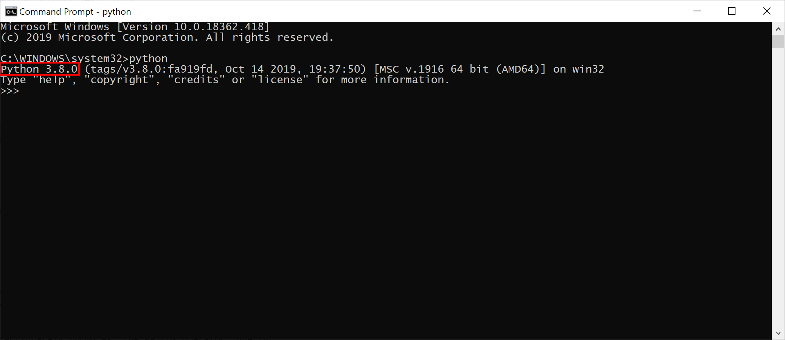

**********************
  Installation Guide
**********************

This will take you through everything you need to install and set up
to be able to start using the py-apteco package.
There are three things you need in total:

1. Access to the Apteco API (Orbit API)
2. A suitable version of Python (3.6+)
3. The py-apteco package

You may skip any steps where you already meet the requirements.

.. note::
    This guide was written with Windows users in mind,
    but the content should apply similarly to other operating systems.

Apteco API
==========

py-apteco uses the Apteco API to connect to your FastStats system.
This is also called the Orbit API and is part of the Apteco Orbit™ installation.
So if you have access to Orbit, you have access to the Apteco API.

If Orbit isn't set up for your FastStats system
or you aren't sure whether you have access to it,
speak to whoever administers your FastStats system
or contact Apteco support (support@apteco.com) who will be happy to help you.

.. note::
    Orbit doesn't need to be installed or running *directly* on your computer,
    you just need to have access to it.
    If you can log into it in the browser on your computer that's fine.

Python
======

py-apteco is a Python package,
so you use it with the Python programming language.

Is Python already installed?
----------------------------

You can check if Python is already installed on your computer
by opening the command line, typing 'python' and pressing return.
If it can find Python installed it will start an interactive Python session,
and you'll also be able to see which version of Python it's running
(indicated here in red):

If Python isn't installed, you may see a message like this:

or it may open the the download page for the Python app in the Microsoft Store
(see `below <microsoft_store_install_>`_
for more information about installing from there).

Which version do I need?
------------------------

py-apteco supports Python versions 3.6+
so if Python is already installed but the version you have is earlier than this
you'll need a later version as well.

.. note::
    You can have multiple different versions of Python installed
    on one computer at the same time,
    you just need to make sure you're using the right one
    for the task at hand.

Downloading from python.org
---------------------------

If you don't have a suitable version of Python installed,
you can download it from the official Python website:
https://www.python.org/downloads/

If in doubt, choose the newest release of the latest version
(at the time of writing, this is Python 3.9.1),
though be aware that this won't necessarily be at the top of the download list.
Once you're on the page for that release,
scroll to the bottom and choose the appropriate download under **Files**.
If you're a Windows user and aren't sure which download option to take,
the **Windows installer** is probably best, highlighted here:

If you don't know whether you need the **32-bit** or **64-bit** version,
go to **Settings** → **System** → **About** on your computer
and check **System type** under **Device specifications**:

.. _microsoft_store_install:

Installing from the Microsoft Store
-----------------------------------

Python versions 3.7+ are available as apps in the Microsoft Store.
Installing Python from here will install it just for your user
and doesn't require administrator privileges,
so this a good option if you don't normally have the necessary permissions
to install programmes.

py-apteco
=========
Once you have Python installed, you can install py-apteco itself.
The easiest way to do this is using ``pip``,
the standard tool for installing Python packages.
From the command line, type:

.. code-block:: console

    python -m pip install apteco

This will fetch the package and install it into your Python environment.
It will also fetch and install its dependencies
(other Python packages which py-apteco itself uses).

.. note::
    Be careful with names:
    **py-apteco** is the name given to this tool as a whole,
    but the name you use to install and use the actual package is just ``apteco``.

Checking your installation
==========================
To make sure everything is installed correctly,
first start a Python interactive session
by opening the command line, typing 'python' and pressing return.
Then type the following commands
(double underscores either side of 'version'):

.. code-block:: python

    >>> import apteco
    >>> print(apteco.__version__)
    0.8.1-beta.1

If everything is working as expected,
this should print the version of py-apteco you have installed.
