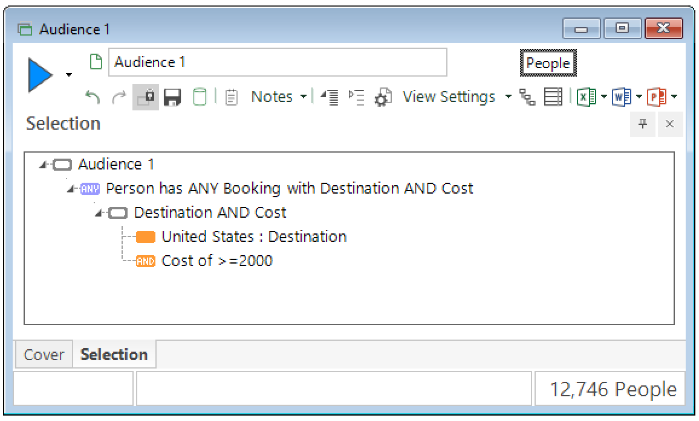
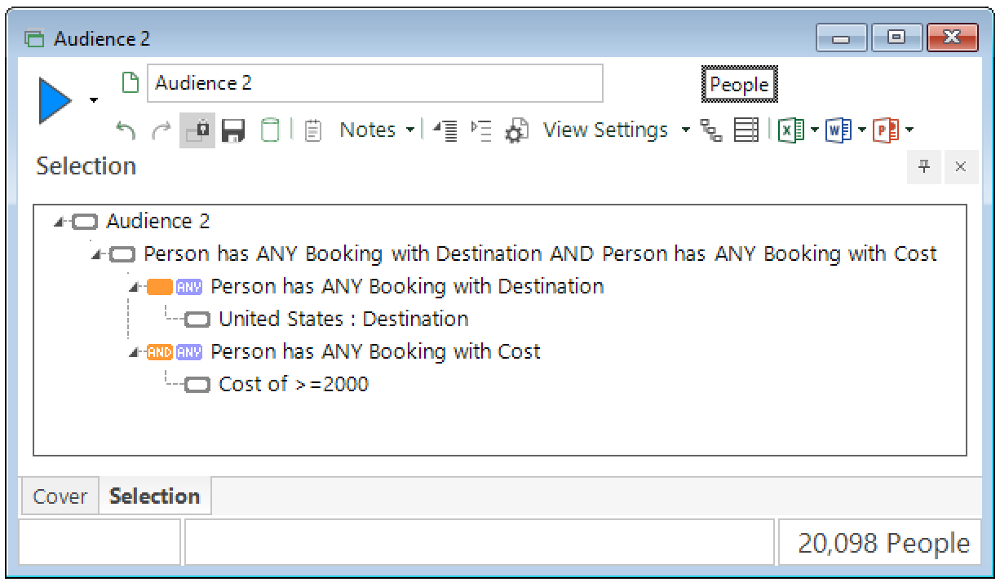

**********************************************
  Controlling selection structure and tables
**********************************************

In this part of the tutorial we'll learn
how to control the way a selection is structured and joined together
and how to change which table the selection counts.

Joining more than two selections together
=========================================

We can use the ``&`` ``|`` ``~`` operators we saw in the previous part
to build more complex selections made of multiple parts:

.. code-block:: python

    >>> low_price_deals_audience = eligible_for_discount & ~high_earners

We could have even written the ``eligible_for_discount`` variable directly
using its constituent parts:

.. code-block:: python

    >>> low_price_deals_audience = (student | under_21) & ~high_earners

Here we've had to use parentheses
so that the ``student | under_21`` gets combined first,
before the selection resulting from that is combined with ``~high_earners`` .
Without parentheses, Python's `operator precedence rules
<https://docs.python.org/3/reference/expressions.html#operator-precedence>`_
mean this would be calculated as:

.. code-block:: python

    >>> not_what_we_meant = student | (under_21 & ~high_earners)  # since & takes precedence over |

Even if operator precedence means that your selection would resolve as intended
without parentheses,
it's probably sensible to include them to be explicit and improve readability:

.. code-block:: python

    >>> either_of_two_pairs = (student & smiths) | (high_earner & under_21)

The ``&`` operator 'binds' more tightly than the ``|`` operator,
so this selection would resolve in the same way even if the parentheses were omitted.
But including them makes the logic easier to read
and enables you to communicate your intent to anyone else reading your code.

Determining the resolve table
=============================

The *resolve table* simply refers to the FastStats system table
that the selection is set to count records from.
As mentioned in the previous part, this is determined automatically
according to the following rules:

* for a selection consisting of a single 'clause',
  it is the table that the variable in this clause belongs to
* for a selection made from a combination of several 'clauses',
  it is the table of the first (i.e. left-most) clause
* normal Python operator precendence applies,
  including expressions in parentheses being evaluated first

The following code demonstrates this:

.. code-block:: python

    >>> student = people["peOccu"] == "4"
    >>> usa = bookings["boDest"] == "38"
    >>> student.table_name
    'People'
    >>> usa.table_name
    'Bookings'
    >>> (student & usa).table_name
    'People'
    >>> (usa & student).table_name
    'Bookings'

So if your selection uses elements from different tables,
make sure you begin it with an element from the table
you want to use for the overall count.

Changing the resolve table
==========================

We can also manually change the resolve table of a selection
using the multiplication operator ``*`` with the table:

    >>> been_to_usa = people * usa
    >>> been_to_usa.count()
    273879
    >>> been_to_usa.table_name
    'People'

.. note::

    The table that we 'multiply by' needs to be a :class:`Table` object.
    Using the string of the table name will **not** work.

Again, we can use parentheses to group different parts of the selection
to control how it is structured:

.. code-block:: python

    >>> audience_1 = people * (usa & at_least_2k)
    >>> audience_1.count()
    12746
    >>> audience_2 = (people * usa) & at_least_2k
    >>> audience_2.count()
    20098

``audience_1`` selects people who have any Booking to the USA costing at least £2000
— the ``usa`` and ``at_least_2k`` clauses are grouped together with parentheses,
so a person must have a *single* Booking matching *both* criteria to be selected.

It is equivalent to this selection in FastStats:

``audience_2`` selects people who have any Booking to the USA,
and have any Booking costing at least £2000.
The difference is that the conditions don't have to apply to the same booking
— the person's Booking to the USA could cost less than £2000,
as long as they have another Booking that *does* cost at least that much.

Here's the equivalent selection in FastStats:

A worked example
================

Let's just remind ourselves what ``audience_2`` looked like
and work through step-by-step how it's evaluated, according to the rules above.

.. code-block:: python

    >>> audience_2 = (people * usa) & at_least_2k

``(people * usa)`` is evaluated first because it's in parentheses.
``usa`` is a condition on the Bookings table,
but using the ``*`` operator on it with the People table manually changes it
to resolve to the People table.

We could re-write this part as a new variable:

.. code-block:: python

    >>> audience_2 = people_to_usa & at_least_2k

Working left-to-right, ``people_to_usa`` is clearly a selection on the People table
so ``at_least_2k`` is automatically adjusted to resolve to the People table to match.
We could re-write this behaviour explicitly as:

.. code-block:: python

    >>> audience_2 = people_to_usa & (people * at_least_2k)

If we 'unzip' ``people_to_usa`` to its original form, we get:

.. code-block:: python

    >>> audience_2 = (people * usa) & (people * at_least_2k)

which mirrors the structure of the equivalent selection in FastStats shown above.

That's the end of the tutorial!
Hopefully you're now equipped with the knowledge you need
to build and count your own selections.
Check out the rest of the documentation for more guidance,
and if you have any questions,
don't hesitate to `get in touch <mailto:support@apteco.com>`_.
